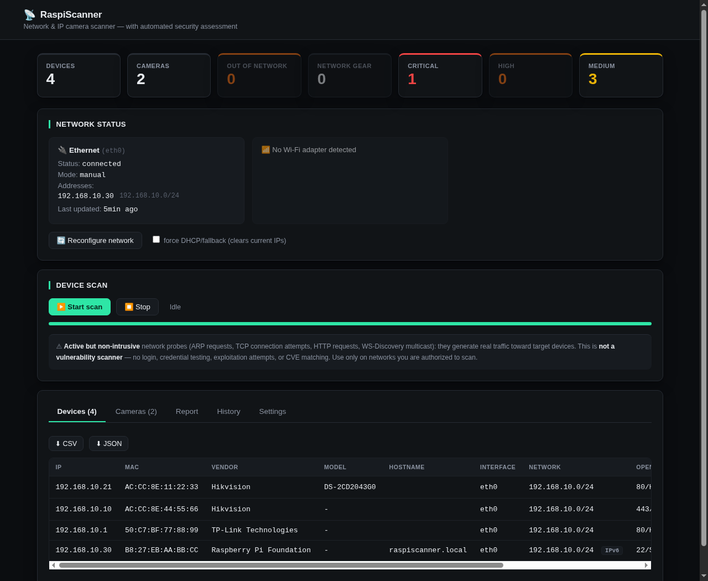

# RaspiScanner

**Status: pre-1.0.0.** A network discovery and security-exposure scanner for
local networks, built to run unattended on a Raspberry Pi (or any Linux
box). Point it at an unfamiliar network over Ethernet, Wi-Fi, or an active
VPN tunnel: it auto-configures itself, discovers what's connected — IP
cameras, NVR/DVR, network gear, general hosts — and produces a security
report from active but non-intrusive probes. Available as a web dashboard
and as a command-line tool.

## Why RaspiScanner?

Good tools already exist for generic network discovery (Nmap, Netdiscover,
arp-scan) and for talking to individual cameras via ONVIF/RTSP. Neither
covers RaspiScanner's use case on its own: a portable device that
auto-configures itself on an unfamiliar network without knowing the
subnet/gateway in advance, discovers what's on it, **distinguishes camera
from NVR/DVR from network gear**, and produces a security assessment built
for surveying an existing video surveillance installation — not a generic
network audit. It doesn't reinvent Nmap; it builds a focused layer on top
of some of the same discovery mechanisms.

## What it does

1. **Ethernet auto-configuration.** Tries **DHCP** first. If none arrives,
   it doesn't need to be told the subnet: it tries a short built-in list
   of common private ranges (192.168.1.0/24, 192.168.0.0/24, 10.0.0.0/24,
   etc. — hardcoded in `scanner/config.py`, nothing to configure) and
   keeps whichever one an ARP check finds hosts on. If more than one
   does, it won't guess: the dashboard lists every candidate (with host
   counts) and asks you to pick. Pre-existing IPs are left alone
   ("manual" mode). This step only decides the device's **own** address —
   what gets scanned is a separate, explicit setting (see below), not an
   automatic side effect of this one. Runs continuously — unplug/replug
   the cable and it reconfigures on its own.

2. **Device scan**, target networks configured independently of the
   step above ("Scan targets" on the dashboard, next to "Start scan"):
   by default, every network detected on an active interface — Ethernet,
   every Wi-Fi adapter present, every active VPN tunnel (WireGuard,
   OpenVPN, PPP, Tailscale, ZeroTier) — plus any custom network you add
   explicitly (must be a **private** IPv4 network, `/22` or smaller —
   this isn't meant to point the device at arbitrary public hosts, or
   at a range too big for the sequential per-host scan to finish in a
   reasonable time). ARP for a network the device has an address in; ICMP
   sweep for one it doesn't (a VPN tunnel the kernel marks NOARP, or a
   custom network reachable only by routing) — no MAC there, ARP can't
   cross a router. Per host: TCP port scan + HTTP banners, ONVIF
   WS-Discovery (real vendor/model via `GetDeviceInformation` when
   available), mDNS/Bonjour (friendly name, and for Apple devices the
   real hardware model from a TXT record), offline OUI vendor lookup,
   reverse DNS. Classified by specificity: **Camera**/**NVR-DVR**
   (protocol signals, not MAC vendor), **Router**/**Switch**/**Access
   Point**, **Raspberry Pi**/other recognized IoT hardware,
   **Phone**/**Tablet**/**Mac**/**PC** (from hostname patterns), **PC
   (Windows/SMB)**/**Network printer** as a fallback, or **Generic** if
   no signal is available at all — a structural limit for locked-down
   devices, not a bug.

3. **"NETWORK ASSESSMENT" report**: per network, devices by category
   (cameras/NVR/network/other — every discovered device shows up
   somewhere), security findings from active but non-intrusive probes
   (Telnet exposed, RTSP exposed, HTTP without HTTPS, admin interfaces,
   default-looking services), and a risk summary (Critical/High/Medium/
   Low). Flags itself as a partial snapshot if requested mid-scan. See
   `examples/sample_report.txt`. Available from the dashboard's "Report"
   tab and from the command line (`--report`).

4. **Web dashboard** (port `7332`, HTTP polling, no external CDN
   dependency — works offline too; protected by a login, see
   [Dashboard authentication](#dashboard-authentication)): network status,
   one card per **each** detected Wi-Fi adapter with independent
   listing/connection, "Devices" table, "Cameras" table (also includes
   NVR/DVR, split into on-network vs. out-of-network), "Report" tab,
   "History" tab (past scans, MAC-based asset database, scan-to-scan
   diff, one-hop network topology from LLDP/CDP), "Settings" tab to
   manage users/webhook/continuous monitoring, **CSV/JSON** export.

5. **Wi-Fi hotspot** ("📡 Hotspot" popup on a Wi-Fi adapter's card): turns
   that adapter into an access point for reaching the dashboard without a
   cable. SSID/password configurable (auto-generatable); the profile
   persists across reboots. Activating it disconnects that radio from
   whatever network it was on — with two Wi-Fi adapters, dedicate one to
   the hotspot and keep the other as a client. Requires NetworkManager
   (`nmcli`).

6. **Supplementary discovery signals**: 802.1Q **VLAN tag** on ARP
   traffic when present; optional **SNMP** (`sysDescr`/`sysName`,
   community `public`, read-only, only on hosts already suspected to be
   network gear) as a vendor/hostname fallback; passive **LLDP/CDP**
   listening, correlated to devices by MAC and shown as a one-hop
   **network topology map** (`GET /api/topology`); **IPv6** discovery via
   ICMPv6 Echo to the link-local all-nodes multicast. All best-effort and
   additive to the primary IPv4/ARP scan, never required for a device to
   show up.

7. **History, monitoring, and audit** (SQLite-backed, `data/history.db`,
   never committed): every completed scan is saved, an optional
   **webhook** notifies a URL of the result (including what changed since
   the previous scan) — combine it with **Continuous Monitoring mode** to
   get scans run automatically every N minutes without a human clicking
   "Start scan". **Audit mode** (`GET /api/audit/report`) generates a
   report from a saved scan (reproducible, unlike the live "Report" tab)
   with a changes-since-previous-scan section prepended automatically.
   Full reference: [`API.md`](API.md).

## What it doesn't do

- **It is not a vulnerability scanner.** No exploitation, no default/
  brute-force credential testing, no CVE matching. Findings describe what
  a service *exposes* to a normal connection, never whether it's actually
  exploitable — see [Security notes](#security-notes).
- **It doesn't get MAC/vendor for anything beyond a router.** ARP only
  works on a directly connected L2 segment. A custom scan target the
  device has no address in (see "Scan targets" above) is still reached —
  via an ICMP sweep routed through the kernel's own routing table — but
  without a MAC, a vendor, or ONVIF/mDNS/LLDP-CDP/IPv6 for hosts found
  there, same as a VPN tunnel today.
- **It doesn't build a multi-hop network map.** Topology (`GET
  /api/topology`) is one hop — the gateway and directly observed LLDP/CDP
  neighbors — not a full network graph. That would need SNMP-walking
  remote switches with credentials this tool doesn't have and won't guess.
- **It isn't tuned for very large networks.** Hosts within a scan are
  processed one at a time; see [Known limitations](#known-limitations).
- **It doesn't phone home.** No telemetry, no cloud dependency, no
  external service required to function — everything it needs (an OUI
  database, its own TLS certificate) works offline.

## Screenshot



*(Illustrative data — a Hikvision camera, NVR, TP-Link router, and a
Raspberry Pi — not a real scan of anyone's network.)*

## Quick start

```bash
git clone https://github.com/Scorp1oner0/raspiscanner.git
cd raspiscanner
sudo ./install.sh
```

Dashboard at `https://<device-ip>:7332`. A bootstrap admin account and
random password are created on first launch and printed to the service
log — see [Dashboard authentication](#dashboard-authentication) for the
full flow. Full install/upgrade/uninstall instructions further down.

## Example output

```
$ sudo python3 raspi-scanner.py --report

NETWORK ASSESSMENT
────────────────────────────

Network: 192.168.10.0/24

4 devices discovered
Summary: 1 camera, 1 NVR/DVR, 1 network device, 5 security findings

SECURITY
  ⚠ Telnet exposed — 192.168.10.10 (Hikvision NVR)
  ⚠ HTTP service detected, no HTTPS available — 192.168.10.1 (TP-Link Technologies network device)
  ⚠ RTSP exposed (stream reachability not verified) — 192.168.10.10 (Hikvision NVR)

RISK SUMMARY
  Critical: 1
  High:     0
  Medium:   3
  Low:      1
```

Full example, including the disclaimers every report ends with:
[`examples/sample_report.txt`](examples/sample_report.txt).

## Architecture, in brief

```
ethernet/wifi/VPN status  →  ARP/ICMP discovery  →  per-host fingerprint
(ports, ONVIF, mDNS, SNMP)  →  classification (camera/NVR/network/host)
→  security findings + risk summary  →  dashboard / JSON API / text report
```

Four independent classifiers (camera, NVR, network gear, generic host)
run on every discovered device; the most specific one wins. Continuous
Monitoring and Audit mode reuse this exact pipeline — an automatic scan
and a manual one are the same code path, and an Audit report is generated
from a saved scan rather than a separate mechanism. Full breakdown,
module-by-module, in [`docs/ARCHITECTURE.md`](docs/ARCHITECTURE.md).

## Usage

```bash
# Web dashboard (default)
sudo python3 raspi-scanner.py

# Command-line report: full scan + print NETWORK ASSESSMENT, then exit
sudo python3 raspi-scanner.py --report
```

The dashboard is a client of RaspiScanner's own JSON HTTP API — see
[API.md](API.md) if you want to script against it (same HTTP Basic Auth
credentials, no separate token).

## Requirements

- Linux (built for Raspberry Pi OS) with Python 3.9+.
- Must be run as **root** (or with `cap_net_raw,cap_net_admin`
  capabilities): needed for the raw ARP scan and to reconfigure the
  interface (`ip addr`, `dhclient`).
- System packages: `python3-venv`, `isc-dhcp-client` (for `dhclient`).
  `nmcli` (NetworkManager) is optional, used only for Wi-Fi
  listing/connection.

## ARP scan limits (read before reporting "can't find a device")

The device scan is ARP-based: it only finds hosts that have an IP in the
scanned subnet and respond within the timeout. Some cases that look like
bugs aren't:

- **The machine running the scanner itself** would never receive its own
  broadcast ARP request back (no switch forwards it back out the port it
  came in on) — that's why the tool always adds it explicitly to the
  results, since it already knows its own IP and MAC without needing to
  query the network.
- **Unmanaged switches** (many cheap models) have no IP address at all:
  they're pure L2 electronics and are invisible to *any* IP-based scan,
  not just this one. If a network device never shows up, check whether it
  actually has an IP management interface.
- **A device on another subnet/VLAN**, reachable only through routing
  (e.g. ping works but goes through the gateway), will never be found by
  the ARP scan: it's a protocol limit, not a bug — ARP doesn't cross a
  router. It needs to be scanned from the correct L2 segment.
- **A just-connected host** may not respond yet: if the upstream switch
  has (R)STP active, the port stays in "listening" state for a few
  seconds before forwarding traffic, on top of the time the device itself
  takes to do DHCP at boot. Wait 20-30s after plugging in a cable before
  running the scan, or rerun it if the first pass doesn't find it.
- To independently verify, outside this tool, whether a device is really
  reachable on the subnet: `sudo arp-scan --interface=eth0 --localnet` or
  `sudo nmap -sn <subnet>`, or check the router/AP's DHCP lease table.

## Known limitations

Everything below is implemented and covered by unit/integration tests,
but hasn't been characterized on real hardware or a real network of
that shape yet — documented honestly rather than left for you to
discover:

- **Large networks (`/16` or bigger).** Hosts are scanned one at a time
  after the initial ARP/ICMP sweep (the per-host port scan is
  parallelized internally, but there's no parallelism *across* hosts) —
  on a subnet with hundreds or thousands of live hosts, this loop is the
  dominant factor in total scan time, more than any single timeout.
  Not parallelized further without a real large network to validate
  correctness against (shared state across concurrent hosts, stop-flag
  responsiveness mid-batch) — see
  [docs/ARCHITECTURE.md](docs/ARCHITECTURE.md) for the full reasoning.
- **RAM usage on large scans.** Not measured against a real network big
  enough to matter; each device's data is modest, but hasn't been
  profiled at scale.
- **Raspberry Pi 4/5 scan times.** Measured on a real Pi 3B+, two
  distinct scenarios — not the same test, don't compare them directly:
  **10.98s** for a single `/24` network (eth0 only, 4 live hosts,
  confirmed again at ~11s in a separate run) and **22.3s** for a
  multi-interface scan (eth0 + Wi-Fi together, two networks, 8 live
  hosts combined, full classification included). Both land around
  2.7-2.8s/host, so the two figures are consistent, not conflicting —
  the higher number is a bigger combined workload, not a slower single
  scan. Pi 4/5 not yet benchmarked.

None of these block using the tool day to day; they're gaps in
*measurement*, not known bugs.

## Installation

`sudo ./install.sh` (see [Quick start](#quick-start)) installs the
project into `/opt/raspiscanner`, creates a virtualenv, installs the
Python dependencies (`Flask`, `scapy`), and registers/starts the
`raspiscanner.service` systemd service.

To run it without installing it as a service, for development:

```bash
python3 -m venv venv && source venv/bin/activate
pip install -r requirements.txt
sudo venv/bin/python3 raspi-scanner.py
```

### Upgrading

Pull the latest sources and re-run the installer:

```bash
git pull
sudo ./install.sh
```

`install.sh` is safe to re-run on an existing installation: it preserves
dashboard users, the TLS certificate, and any full OUI database you
previously downloaded (they're excluded from the `rsync --delete` step
that syncs everything else), and restarts the service at the end.

### Uninstalling

```bash
sudo ./uninstall.sh
```

Stops and disables the systemd service, removes the unit file, and
removes `/opt/raspiscanner` entirely — **this deletes dashboard users,
the TLS certificate, and the scanned-device history**. Pass `--keep-data`
to remove everything else but preserve `data/` (useful if you plan to
reinstall later and want to keep your users/certificate):

```bash
sudo ./uninstall.sh --keep-data
```

## Tests

Unit tests, all mocked (no hardware or network access required):

```bash
python3 -m unittest discover -s tests -v
```

## Conflicts with NetworkManager/dhcpcd

If `eth0` is already managed by NetworkManager or `dhcpcd` (default
behavior on Raspberry Pi OS), those services may remove the static IP
assigned by RaspiScanner during the preset-class fallback. To avoid
conflicts, mark `eth0` as "unmanaged":

- **NetworkManager**: add to `/etc/NetworkManager/conf.d/unmanaged.conf`
  ```ini
  [keyfile]
  unmanaged-devices=interface-name:eth0
  ```
  then `sudo systemctl restart NetworkManager`.
- **dhcpcd**: add to `/etc/dhcpcd.conf`
  ```
  denyinterfaces eth0
  ```
  then `sudo systemctl restart dhcpcd`.

Wi-Fi (`wlan0`) can stay normally managed by NetworkManager: the scanner
only reads its status, it doesn't touch it (aside from the optional
connection endpoint via `nmcli`).

## Offline vendor (OUI) database

`data/oui.csv` is a reduced, "best effort" list of the most common
vendors (networking, IoT, IP cameras, Raspberry Pi) meant to work
**without internet** in the field. Camera recognition doesn't depend on
this file (it's based on ports/protocol), so a missing vendor is only a
missing informational label, not a scan accuracy problem.

`install.sh` already tries to download the full IEEE registry (~35,000
prefixes) automatically during installation, while the device is still
connected to the internet: if it succeeds, there's nothing else to do. If
the installation happened offline, or you want to update an already
installed copy, rerun the script manually (from a machine **with**
internet access — it doesn't have to be the Pi itself, if you then copy
the result into `data/oui.csv`):

```bash
python3 scripts/update_oui.py
```

Note for reinstalls: `install.sh` overwrites `data/oui.csv` with the
repo's minimal version on every `rsync`, so on an already-updated
instance it needs to be rerun **after** every reinstall, not just the
first time (unless you have internet at that moment, in which case it
already does it for you).

## Security notes

This is a network reconnaissance tool, **not a vulnerability scanner**:
only use it on networks you are authorized to scan. The ARP scan, port
scan, and security findings are **active but non-intrusive** network
probes — they send real packets (ARP requests, TCP connection attempts,
HTTP requests, WS-Discovery multicast), so they're not "passive" in the
strict sense, but they never perform login, default/brute-force
credential testing, exploitation attempts, or CVE matching — and they do
generate traffic visible on the target network. Security findings
describe what a service *exposes* to a normal connection (an open Telnet
port, an HTTP admin panel with no HTTPS, ...), never whether it is
actually exploitable.

### Dashboard authentication

The dashboard listens on `0.0.0.0:7332` and exposes the full inventory of
scanned devices (IP, MAC, vendor, **camera RTSP/admin URLs**) plus the
network/hotspot controls: it's protected by **HTTP Basic Auth** so that
anyone simply on the same network/hotspot during the scan can't access it
without credentials, served over **HTTPS** with a self-signed certificate
generated on first launch (persisted in `data/tls_cert.pem`/
`data/tls_key.pem`) so credentials travel encrypted instead of in the
clear over the network you're scanning. If the certificate can't be
generated (`openssl` missing or failing), **the service refuses to start**
rather than silently falling back to plain HTTP — that fallback would
defeat the point of Basic Auth entirely, and worse, without anyone
noticing.

There's no certificate signed by a public CA for this use case: the
device (Raspberry Pi or Linux PC) gets installed on a different private
network every time, often without internet access, and reached by IP, not
by domain — conditions under which a CA like Let's Encrypt can't issue or
renew anything. Because of this, like routers/NAS/network printers, the
browser will show an **"insecure connection" warning** on first access:
that's expected, accept it once (the certificate stays the same across
restarts, the warning doesn't repeat on every boot). It protects against
passive traffic interception on the same network, not against a very
sophisticated active man-in-the-middle attack that nobody actually
verifies in practice (certificate fingerprint) — a real improvement over
plain HTTP, not an absolute guarantee.

On first launch, if `data/users.json` doesn't exist yet, a bootstrap user
`RaspiScanner` is created with a **random password**, printed once to the
service log:

```
sudo journalctl -u raspiscanner -n 20 --no-pager
# bootstrap account created — username: RaspiScanner  initial password: <random>
```

There is no fixed, well-known default password — every installation gets
its own, generated at first startup, never hardcoded anywhere. This
account is also marked "must change password": the dashboard shows
**nothing else** until you set a new password, so it can't accidentally
be left running on the random bootstrap one. Once changed, you can add
other users or remove them from the "Settings" tab. Credentials are
persisted (hashed, never in the clear) in `data/users.json` and survive
service restarts — nothing needs to be redone on every boot. The browser
asks for the username/password once and remembers it for the browsing
session.

Three roles, each seeing a progressively bigger slice of the dashboard:
**viewer** (Devices/Cameras only — the live inventory, nothing else),
**operator** (also Report, History, and topology — everything except
Settings), and **admin** (everything, including user/webhook/monitoring
management). Enforced on both sides: the dashboard hides tabs a role
can't use, and every API route independently rejects a role below its
minimum — see [`API.md`](API.md) for the exact requirement per endpoint.

`data/users.json` is in `.gitignore`: it must not be committed (it
contains the password hashes for that specific deployment).

## Project structure

```
raspi-scanner.py            Entry point: Flask dashboard (default) or CLI --report
scanner/
  config.py                  Shared constants (preset classes, ports, timeouts)
  auth.py                     Dashboard users (Basic Auth, persisted in data/users.json)
  tls.py                       Self-signed TLS certificate for the dashboard (via openssl)
  vendor.py                   Vendor lookup from offline OUI
  hosts.py                     Classification "is it a phone/tablet/Mac/PC/printer?"
  scan_engine.py                Scan orchestration + state for the dashboard
  storage.py                     Scan history/asset database (SQLite, data/history.db)
  webhooks.py                    Optional POST notification after each scan
  monitoring.py                  Continuous Monitoring mode (scheduled automatic scans)
  targets.py                     Scan targets: custom networks beyond active interfaces
  discovery/
    arp.py                       ARP scan (scapy) + reverse DNS + VLAN tag
    icmp.py                       ICMP sweep for NOARP links (VPN tunnels)
    mdns.py                       mDNS/Bonjour probe (friendly name + Apple model)
    snmp.py                       Optional SNMP probe (sysDescr/sysName)
    lldp_cdp.py                   Passive LLDP/CDP listening (network topology)
    ipv6.py                       IPv6 discovery (ICMPv6 Echo to ff02::1)
  fingerprint/
    ports.py                      TCP port scan + HTTP banners
  cameras/
    onvif.py                       WS-Discovery + GetDeviceInformation (ONVIF)
    classify.py                     Classification "is it a camera?"
  nvr/
    classify.py                      Classification "is it an NVR/DVR?"
  network/
    setup.py                          Eth autoconfig (DHCP/fallback) + monitor + wifi/VPN status
    infra.py                           Default gateway + "is it network gear?"
    hotspot.py                          Wi-Fi access point (cable-free reachability)
  reporting/
    security.py                         Security findings (Telnet, HTTP, default service)
    risk.py                              Severity aggregation -> risk summary
    assessment.py                         Generates the NETWORK ASSESSMENT report
tests/                       Unit tests (mocked, no hardware required)
docs/ARCHITECTURE.md         More detailed architectural overview
examples/                    Report examples and programmatic use of the classifiers
scripts/update_oui.py        Updates oui.csv from the IEEE registry (requires internet)
data/oui.csv                 Offline OUI database (best effort)
data/users.json              Dashboard users (password hashes, generated on first launch, gitignored)
data/tls_cert.pem, tls_key.pem  Self-signed TLS certificate (generated on first launch, gitignored)
data/history.db              Scan history/asset database (SQLite, generated on first scan, gitignored)
data/webhooks.json           Webhook config (generated on first save, gitignored)
data/monitoring.json         Continuous Monitoring config (generated on first save, gitignored)
data/targets.json            Scan targets config (generated on first save, gitignored)
templates/, static/          Dashboard (HTML/CSS/JS, no external CDN: works offline)
install.sh                   Installer (venv + systemd)
raspiscanner.service         systemd unit file
LICENSE                      MIT
```

More on the scan flow and architectural choices in
[`docs/ARCHITECTURE.md`](docs/ARCHITECTURE.md).

---

by Andrea Biral — Scorpionero
